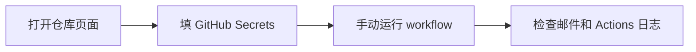

# GitHub Actions 零基础配置教程

这份教程只服务一件事：把 `US Stock Portfolio Report` 跑起来，并且让你每天在邮箱里收到更容易阅读的持仓报告。如果你完全没配过 GitHub Actions，也可以按下面顺序一步步完成。



## 你会用到的两个页面

第一个页面是仓库首页。仓库名在页面左上角，顶部会看到 `Code`、`Issues`、`Actions`、`Settings` 这些标签。

第二个页面是 Secrets 配置页。路径固定是：

`Settings` -> `Secrets and variables` -> `Actions`

进入后不要切到 `Variables`，先停留在 `Secrets` 标签页，因为持仓、邮箱授权码、新闻 key 都应该放在加密的 `Repository secrets` 里。

## 最省事的配置方法

最快的方法不是手填很多个 Secret，而是先打开 [config-wizard.html](config-wizard.html)。

在这个页面里：

- 持仓区填 `Ticker`、`数量`、`成本价`。
- 邮件区如果用 QQ 邮箱，只填 `QQ 邮箱` 和 `QQ 邮箱授权码`。
- 新闻源区建议先填 `Brave Search key` 或 `Tavily key`。
- 如果你希望邮件附带每只股票的周、月、年三联 K 线图，保留 `附带每只股票 K 线图 = 是`。

页面右侧会自动生成一大段终端命令。你只需要复制那一段。

## 在终端执行向导命令

打开终端以后，先确认 GitHub CLI 已登录：

```bash
gh auth status
```

如果终端提示没有登录，就执行：

```bash
gh auth login
```

登录完成后，把配置向导右侧生成的整段脚本直接粘贴到终端执行。执行成功后，`PORTFOLIO_JSON`、邮箱配置、新闻源配置、图表开关等内容会被一次性写进仓库 Secrets。

## 如果你想手工填写 Secrets

进入：

`Settings` -> `Secrets and variables` -> `Actions` -> `Repository secrets`

然后点击 `New repository secret`，至少填下面这些：

| Name | 填什么 |
|---|---|
| `PORTFOLIO_JSON` | 你的完整持仓 JSON |
| `EMAIL_ADDRESS` | 你的 QQ 邮箱 |
| `EMAIL_AUTH_CODE` | QQ 邮箱 SMTP 授权码 |
| `BRAVE_API_KEY` | Brave Search key，可选但推荐 |
| `TAVILY_API_KEY` | Tavily key，可选但推荐 |
| `EMAIL_INCLUDE_CHARTS` | `true`，表示邮件附带每只股票的 K 线图 |

如果你没有新闻源 key，也可以先只填前三项。这样 workflow 仍然能跑，只是新闻背景会更弱。

## 运行前先检查

本项目现在有一个预检脚本，会在正式生成日报前检查：

- `PORTFOLIO_JSON` 能不能解析。
- QQ 邮箱或 SMTP 配置是不是完整。
- Ark、DeepSeek、通用 LLM 配置是不是缺字段。
- 新闻源顺序里有没有写错 provider 名称。
- K 线附件开关打开时，依赖是否完整。

你本地如果装好了依赖，可以先运行：

```bash
python scripts/preflight.py
```

如果是在 GitHub Actions 里跑，workflow 也会自动先执行这一步。

## 第一次手动运行 workflow

打开仓库顶部的 `Actions`。

左侧找到 `US Stock Portfolio Report`。

点击右上角 `Run workflow`。

如果是第一次跑，建议：

- `report_type` 选 `daily`。
- 点击绿色的 `Run workflow` 按钮。

几秒后页面会出现一条新的运行记录。点进去以后，重点看三个位置：

- `preflight` 有没有报缺字段。
- `Daily report` 有没有生成 `ok=true` 的 JSON。
- `send_email_report` 里有没有 `sent: true`，以及 `chart_attachments.count` 是否大于 0。

## 你应该看到什么结果

如果一切正常：

- 收件邮箱会收到一封主题为 `Stock-EGON 每日美股持仓简报` 的邮件。
- 邮件正文是适合阅读的普通文本和 HTML，而不是原始 Markdown 符号。
- 每只股票会附带一张图片，图片里包含 1 周、1 月、1 年三联 K 线图。

如果没收到邮件，优先检查：

- `EMAIL_AUTH_CODE` 填的是不是 SMTP 授权码，而不是网页登录密码。
- `EMAIL_ADDRESS` 是不是 QQ 邮箱。
- `EMAIL_INCLUDE_CHARTS=true` 时，依赖有没有正确安装。
- `NEWS_PROVIDER_ORDER` 里有没有写不存在的 provider。

## 最容易犯错的地方

`PORTFOLIO_JSON` 必须是合法 JSON，不能多逗号，不能写注释。

`EMAIL_AUTH_CODE` 不是 QQ 登录密码，而是邮箱设置里单独生成的 SMTP 授权码。

`ARK_API_KEY` 和 `ARK_MODEL` 需要成对出现。只有 key 没有 model 时，预检会直接失败。

`LLM_API_KEY` 如果不是 OpenAI 官方接口，一般还要配 `LLM_BASE_URL` 和 `LLM_MODEL`。

`NEWS_PROVIDER_ORDER` 当前支持的名字只有：

`brave,tavily,serpapi,alphavantage`

## 跑通之后做什么

如果你已经收到第一封邮件，下一步只需要做两件事：

- 在 `Actions` 页确认 workflow 没被禁用。
- 后续只在配置向导里更新持仓和成本价，再重新执行一次生成的终端脚本。
