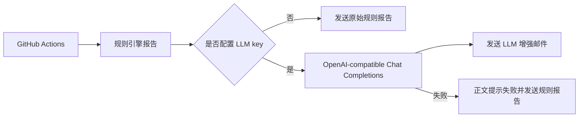

# LLM 投研助理配置指南

## 定位

LLM 投研助理是邮件发送前的可选增强层。规则引擎先生成日报或周报，LLM 只负责把这份规则报告改写成更适合邮件阅读的中文解释。LLM 不负责抓行情，不负责改评分，不负责创造买卖结论，也不构成投资建议或交易指令。

## 最简 DeepSeek 配置

如果只想用 DeepSeek，在 GitHub `Settings` -> `Secrets and variables` -> `Actions` -> `Secrets` 中新增：

| Name | Secret 填什么 |
|---|---|
| `DEEPSEEK_API_KEY` | DeepSeek API key |

系统会自动使用 `https://api.deepseek.com` 和 `deepseek-chat`。如果要换 DeepSeek 模型，可以额外配置 `DEEPSEEK_MODEL`。

## 火山方舟配置

如果 API key 来自火山方舟，应使用 Ark 专用字段，不要把火山方舟 key 填到 `DEEPSEEK_API_KEY`。在 GitHub Secrets 中新增：

| Name | Secret 填什么 |
|---|---|
| `ARK_API_KEY` | 火山方舟 API key |
| `ARK_MODEL` | 火山方舟 model 或接入点 ID |

默认 base URL 是 `https://ark.cn-beijing.volces.com/api/v3`。如果你使用其他 region 或网关，可额外配置 `ARK_BASE_URL`。`ARK_MODEL` 必须显式填写，因为火山方舟的 `model` 可能是接入点 ID，也可能是具体模型名，项目不能替用户猜。

## 通用 OpenAI-compatible 配置

如果使用硅基流动、阿里百炼、OpenRouter、Moonshot 或其他兼容 OpenAI chat completions 的平台，配置：

| Name | 填什么 |
|---|---|
| `LLM_API_KEY` | 服务商 API key |
| `LLM_BASE_URL` | 服务商 base URL |
| `LLM_MODEL` | 模型名 |

项目也兼容常见命名：`OPENAI_API_KEY`、`OPENAI_BASE_URL`、`OPENAI_MODEL`。这里的 `OPENAI_API_KEY` 是 OpenAI-compatible 变量名，不代表只能填 OpenAI 官方 key；能否使用取决于对应 `base_url` 是否指向正确服务商。

## 失败策略

未配置 LLM key 时，系统跳过增强，继续发送规则报告。已配置 LLM key 时，如果鉴权失败、模型不可用、接口返回格式异常或网络失败，邮件会在正文顶部写明 `LLM 增强失败，已发送规则版报告` 和具体错误原因，然后继续发送规则报告。这个设计保留可审计错误提示，同时避免可选改写服务阻断核心日报或周报送达。

系统使用 `stream=true` 的 Chat Completions SSE 响应，持续接收模型增量文本并在 `[DONE]` 后拼接完整 Markdown。连接最多等待 10 秒，流读取默认允许相邻数据块间隔 30 秒，可通过 `LLM_TIMEOUT_SECONDS` 调整；因此完整报告可以超过 30 秒生成，只要流没有中断。单次改写默认最多生成 `1600` tokens，可用 `LLM_MAX_TOKENS` 调整，且该值必须是正整数。连接或首次响应超时时，系统等待 1 秒后只重试一次；流已经开始后出现中断会保留失败原因并发送规则报告，避免把部分生成内容误当作完整投资复盘。鉴权失败、模型不可用、HTTP 非成功状态和响应格式错误也会直接进入邮件的规则报告回退路径。

## Codex 边界

GitHub Actions runner 没有你的本机 Codex 登录态，也不会自动拥有 Codex 桌面或 Codex CLI 的会话。要在云端定时任务里稳定运行，应该使用显式 API key。后续如果要做交互式问答，需要增加独立的消息入口、鉴权和回调服务，本指南只覆盖定时邮件增强。
