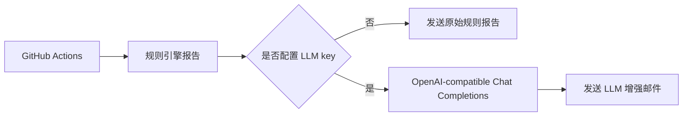

# LLM 投研助理配置指南

## 定位

LLM 投研助理是邮件发送前的可选增强层。规则引擎先生成日报或周报，LLM 只负责把这份规则报告改写成更适合邮件阅读的中文解释。LLM 不负责抓行情，不负责改评分，不负责创造买卖结论，也不构成投资建议或交易指令。

## 最简 DeepSeek 配置

如果只想用 DeepSeek，在 GitHub `Settings` -> `Secrets and variables` -> `Actions` -> `Secrets` 中新增：

| Name | Secret 填什么 |
|---|---|
| `DEEPSEEK_API_KEY` | DeepSeek API key |

系统会自动使用 `https://api.deepseek.com` 和 `deepseek-chat`。如果要换 DeepSeek 模型，可以额外配置 `DEEPSEEK_MODEL`。

## 通用 OpenAI-compatible 配置

如果使用硅基流动、阿里百炼、OpenRouter、Moonshot 或其他兼容 OpenAI chat completions 的平台，配置：

| Name | 填什么 |
|---|---|
| `LLM_API_KEY` | 服务商 API key |
| `LLM_BASE_URL` | 服务商 base URL |
| `LLM_MODEL` | 模型名 |

项目也兼容常见命名：`OPENAI_API_KEY`、`OPENAI_BASE_URL`、`OPENAI_MODEL`。这里的 `OPENAI_API_KEY` 是 OpenAI-compatible 变量名，不代表只能填 OpenAI 官方 key；能否使用取决于对应 `base_url` 是否指向正确服务商。

## 失败策略

未配置 LLM key 时，系统跳过增强，继续发送规则报告。已配置 LLM key 时，如果鉴权失败、模型不可用、接口返回格式异常或网络失败，邮件任务会失败并在 Actions 日志里暴露错误。这个设计是为了避免“以为收到的是 AI 增强报告，实际只是静默降级报告”。

## Codex 边界

GitHub Actions runner 没有你的本机 Codex 登录态，也不会自动拥有 Codex 桌面或 Codex CLI 的会话。要在云端定时任务里稳定运行，应该使用显式 API key。后续如果要做交互式问答，需要增加独立的消息入口、鉴权和回调服务，本指南只覆盖定时邮件增强。
