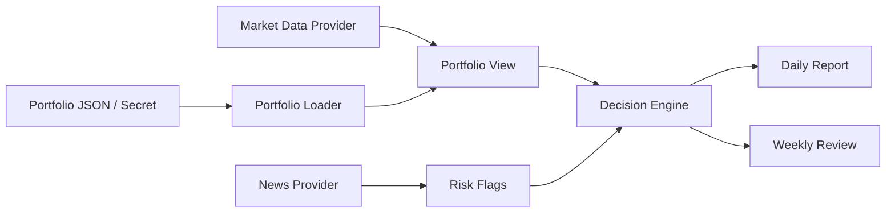

# 美股持仓日报与周报 agent 实现计划

## 目标

构建一个可迁移到 GitHub Actions、Codex automation 或 Codex skill 的美股持仓分析 agent。当前机器只用于开发和验证，真实持仓、API key、新闻源 token 不写入仓库。

## 业务定义

输入包括持仓、现金、行情、指数环境、新闻和可选目标风险偏好。输出包括每日持仓简报、每周复盘、组合风险、单票动作建议、下周观察清单和数据源限制。动作建议分为 `add_candidate`、`trim_candidate`、`hold`、`watch`，用于研究和复盘，不等同于无条件买卖指令。

## 数据流

## 参考仓库吸收点

`ZhuLinsen/daily_stock_analysis` 的可复用思路是 GitHub Actions 定时运行、Secrets 管理配置、多市场行情 provider、新闻源可插拔和多渠道推送。当前实现保持更小边界，不直接复制其完整 Web/API/Bot 系统。

## 第二轮优化

阅读 zip 后吸收了四个设计点：动作 taxonomy 与 guardrail 分离、数据质量先于动作建议、组合风险独立成块、GitHub Actions 兼容 Secrets/Variables 与 artifact 审计。实现上新增 `quality.py`、`guardrails.py`、`risk.py`，并优化 workflow 定时和输出。

## 实施步骤

1. 已写离线核心测试，覆盖持仓解析、组合权重、动作分层、日报和周报结构。
2. 已实现 `us_stock_agent/` 核心模块。
3. 已实现 daily/weekly CLI，支持 `--portfolio-json`、`--portfolio-file` 和 env 配置。
4. 已补 GitHub Actions 模板与部署文档。
5. 已设置 Codex automation，用当前截图持仓作为临时运行输入。
6. 已运行测试、语法检查、CLI 离线 smoke test 和授权联网端到端 smoke test。
