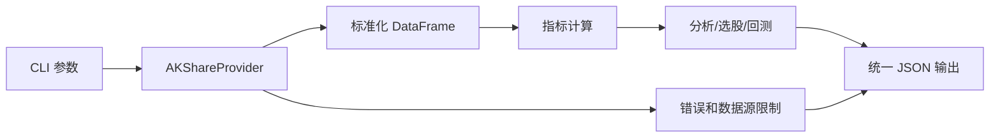
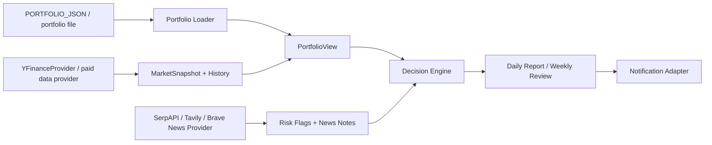

# A 股量化分析工具原则文档

## 定位

本工具用于把公开行情数据转成结构化研究结果，帮助快速完成市场概览、候选筛选、个股技术诊断、经典策略回测、美股长期持仓日报和每周复盘。工具输出是研究参考，不是投资建议、交易指令或合规结论。

当前美股持仓日报和周报是规则引擎，不调用 Codex、OpenAI 或其他 LLM API。后续如果接入 LLM 问答，应作为独立 provider 和独立 secret 进入系统，不能假设使用者拥有当前开发者的 Codex 登录态。

## 数据流

AKShare 数据访问集中在 `a_stock_quant/data_provider.py`，它负责延迟加载 AKShare、调用公开接口、标准化中文字段，并在依赖缺失、接口失败、空数据或字段缺失时抛出明确错误。核心计算模块不直接访问网络，使单元测试可以稳定运行。

美股持仓 agent 的数据流如下：

真实持仓、新闻源 token、SMTP 密码或邮箱授权码、LLM API key 和通知 webhook 应通过 GitHub Secrets、Codex automation prompt 或运行时环境变量注入，不应写入仓库。`config/portfolio.example.json` 和文档示例只能使用假持仓。

## 核心实体

`DailyFrame` 是内部约定的日线数据结构，必需字段是 `date`、`open`、`high`、`low`、`close`、`volume`，可选字段包括 `amount`、`change_pct`、`turnover`。AKShare 原始中文字段进入系统后必须先标准化为这些字段。

`ResultEnvelope` 是所有 CLI 的统一输出骨架，包含 `ok`、`module`、`fetched_at`、`data_time`、`source_api`、`warnings`、`errors`、`data`。上游工具应先判断 `ok`，再读取 `data`。

`Candidate` 是选股候选对象，包含 `code`、`name`、`pe`、`pb` 和 `history`。选股模块只处理已带历史行情的候选对象，不负责抓取数据。

`Portfolio` 是美股持仓输入，包含 `currency`、`cash`、`risk_profile` 和 `holdings`。`Holding` 包含 `symbol`、`quantity`、可选 `cost_basis` 和可选 `target_weight`。`PortfolioView` 结合最新行情计算市值、权重、现金权重、当日盈亏和未实现盈亏。

`ActionRecommendation` 是美股持仓动作分层，动作包括 `add_candidate`、`trim_candidate`、`hold`、`watch`。这些动作是研究候选和复盘标签，不是无条件买入或卖出指令。

`NotificationResult` 是外部通知层的发送结果，至少包含 `sent`、`skipped`、`reason`、`status_code` 和 `response`。未配置通知 webhook 时应显式返回 `skipped=true`，配置了 webhook 但发送失败时应暴露失败，避免报告系统假装已经触达用户。

## 功能边界

多因子选股从成交额靠前候选池开始，默认不直接全市场逐只深度扫描，以控制请求量和源站压力。技术分权重来自均线、MACD、RSI、布林带和成交量，基础面分权重来自 PE、PB 和换手率。`multi_factor` 默认按技术分 65%、基础面分 35% 合成。

个股诊断输出 `偏多`、`偏空`、`震荡` 和 `中性` 等技术信号，同时给出关键观察点和支撑阻力区间。诊断模块不输出“买入”或“卖出”指令。

市场概览输出主要指数、市场广度、行业板块排序和成交额热门个股。板块和热门股只反映当前可获取数据的排序，不代表后续收益。

策略回测支持 `ma_cross`、`macd`、`rsi`、`bollinger`。默认假设是信号生成后一交易日按收盘收益近似成交、全仓或空仓、不使用杠杆、手续费 0.03%、滑点 0.05%、无风险利率 3%。这些假设必须随结果输出，不能隐藏。

美股持仓日报关注前一交易日收盘后的组合状态，但解释周期是 1 个月、1 个季度和 1 年，核心输出包括组合净值、现金权重、增持候选、减持候选、继续持有、重点观察、每只持仓说明和数据限制。每周复盘关注组合集中度、未来事件风险、动作复核和中长期观察清单。评分由趋势、动量、组合集中度、新闻风险和持仓盈亏共同决定，具体参考来源和未验证边界见 `docs/methodology.md`。

动作建议必须通过 guardrail。`add_candidate` 需要行情数据质量至少为 `medium`，并带有进入区间、风险位或失效条件；否则降级为 `watch`。数据质量等级包括 `high`、`medium`、`low`、`poor`、`unknown`，当 quote、daily bars、news 等来源给出多个质量等级时，以最差显式等级为准。

组合风险必须在日报和周报中展示，至少包含单票集中度、现金不足和持仓数量。默认单票集中度阈值为 balanced 30%、aggressive 38%、conservative 22%；现金不足阈值为 balanced/conservative 5%、aggressive 3%。这些阈值用于风险提示，不用于自动交易。

通知层只发送已经生成的报告，不参与评分、风控和数据抓取。默认 workflow 使用 SMTP 邮件推送；QQ 邮箱可通过 `EMAIL_ADDRESS` 和 `EMAIL_AUTH_CODE` 使用内置默认值，其他邮箱使用完整 SMTP 配置。GitHub 的 schedule 是首层触发器，外部 scheduler 可以使用 `workflow_dispatch` 和 `dedupe=true` 作为补发层；该路径必须按北京时间当天 marker 去重，普通人工 `workflow_dispatch` 保持不去重以支持显式重发。LLM 增强层位于邮件发送前，只能基于规则报告改写文字，不得改变底层评分、风险位和动作标签；未配置 key 时跳过，配置后必须用流式 Chat Completions 接收完整 SSE 增量并在 `[DONE]` 后使用结果，连接上限为 10 秒，连续数据块间隔默认最多为 30 秒，单次输出默认最多为 1600 tokens，分别可通过 `LLM_TIMEOUT_SECONDS` 和 `LLM_MAX_TOKENS` 调整。连接或首次响应超时会等待 1 秒后重试一次；流中断或最终外部调用失败时，邮件正文顶部必须写明失败原因，并继续发送规则版报告。邮件交互图链接只携带单个 ticker，并打开公开行情页面，不应把完整持仓列表、持仓数量、成本价或报告 JSON 发布到 GitHub Pages。企业微信群机器人 webhook 只作为可选保留通道。交互式微信问答需要独立的消息接收服务、鉴权、审计和 agent API 调用链路。

新闻层通过 `ALPHA_VANTAGE_API_KEY`、`SERPAPI_API_KEY`、`TAVILY_API_KEY`、`BRAVE_API_KEY` 或对应复数 key 环境变量启用。provider 输出统一的 `NewsItem`，包含 ticker、标题、来源、URL、摘要和粗粒度风险标签。日报和周报只展示压缩后的新闻标题和风险提示，不保存新闻源 key 或 webhook。

## 错误处理原则

工具倾向于正确失败。AKShare 未安装、接口不可用、返回空数据、关键字段缺失、策略名非法时，应输出 `ok=false`，并在 `errors` 中说明原因。除单只候选股拉取失败可以跳过并继续处理其他候选外，其他核心错误应暴露给调用方。

## 风险提示

AKShare 是免费开源数据接口库，但数据来自公开数据源，存在延迟、接口变动、字段变化、源站限流和授权边界问题。任何用于真实交易、对外披露、合规审查或商业服务的场景，都需要替换为有明确授权和服务保障的数据源。

yfinance 使用 Yahoo Finance 公开数据，适合个人研究和复盘。若要长期定时、批量运行或提高稳定性，应接入付费新闻源和授权行情源。SpaceX 等私营公司没有公开 ticker，报告只能覆盖新闻、融资、发射、Starlink、监管和相关上市公司影响，不应生成公开股价或技术指标。
