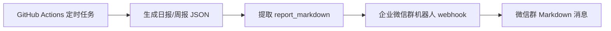
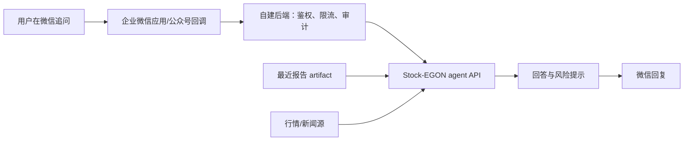

# 微信机器人接入说明

## 当前支持：企业微信群机器人单向推送

当前仓库已经支持企业微信群机器人 webhook。GitHub Actions 生成日报或周报后，会读取报告 JSON 的 `data.report_markdown` 字段，并通过 `WECHAT_WEBHOOK_URL` 推送到企业微信群。

这里说的“微信机器人”准确地说是企业微信的群机器人，不是普通个人微信好友机器人。它适合每天自动把报告推到群里，但不能读取你在群里的追问。



## 从零配置步骤

第一步，准备一个企业微信群。打开企业微信，进入一个你能管理的群；如果还没有群，可以新建一个只有你自己的测试群。普通个人微信群通常没有这个 webhook 机器人入口。

第二步，在群里添加机器人。进入群聊右上角的群设置，找到 `群机器人` 或 `机器人`，选择 `添加机器人`。机器人名称可以填 `Stock-EGON`，头像随意。

第三步，复制 webhook 地址。添加成功后，企业微信会展示一条很长的 URL，形如：

```text
https://qyapi.weixin.qq.com/cgi-bin/webhook/send?key=xxxxxxxx-xxxx-xxxx-xxxx-xxxxxxxxxxxx
```

这一整条 URL 就是 `WECHAT_WEBHOOK_URL`。不要只复制 `key=` 后面的部分，也不要截图保存后手打，直接复制完整地址。

第四步，回到 GitHub 仓库页面，打开 `Settings` -> `Secrets and variables` -> `Actions`。停留在 `Secrets` 标签页，找到 `Repository secrets`，点击 `New repository secret`。

第五步，照表填写：

| 表单字段 | 填写内容 |
|---|---|
| `Name` | `WECHAT_WEBHOOK_URL` |
| `Secret` | 企业微信复制出来的完整 webhook URL |

第六步，保存后去 `Actions` 页面，进入 `US Stock Portfolio Report` workflow，点击 `Run workflow`。`report_type` 先选 `daily` 测试一次。

第七步，确认结果。成功时企业微信群里会收到一条 Markdown 报告；GitHub Actions 日志里也会出现 `send_wechat_report`，其中 `sent` 应该是 `true`。

未配置 `WECHAT_WEBHOOK_URL` 时，发送脚本会返回 `skipped=true`，日报和周报仍然正常生成 artifact。配置了 webhook 但企业微信返回错误时，发送脚本会用非零退出码暴露失败，避免假装已经推送。

## 常见问题

如果你找不到 `群机器人` 入口，通常是因为你在普通个人微信群里，或者当前企业微信组织禁用了群机器人。解决方式是用企业微信建一个群，或者让管理员开启群机器人能力。

如果 GitHub Actions 成功生成报告但微信没收到，先看 Actions 日志里的 `send_wechat_report`。`wechat_webhook_not_configured` 表示没有配置 `WECHAT_WEBHOOK_URL`；`wechat_webhook_failed` 表示 URL 配错、机器人被删、机器人安全策略拦截，或企业微信接口返回失败。

如果机器人设置了关键词安全策略，建议把关键词设成 `美股`、`持仓`、`Stock-EGON` 之一，并确保报告标题或正文里包含该关键词。当前报告标题包含 `每日美股持仓简报` 或 `每周持仓复盘`，通常可以命中 `美股` 或 `持仓`。

如果你只是想先测试 webhook 本身，可以先不等定时任务，直接手动运行 GitHub Actions 的 `daily` report。仓库里的发送脚本会把生成好的报告推送到同一个 webhook。

## 交互式问答的边界

企业微信群机器人 webhook 不能接收用户消息，因此它不能完成“我在微信里追问，它继续回答”的交互。它适合做定时推送，不适合做对话入口。

交互式问答需要单独增加消息入口和后端服务。推荐方案是企业微信应用或微信公众号接收用户消息，自建后端校验签名和白名单，然后把问题、最近一次报告、持仓配置和可用新闻源一起交给 agent API，最后把回答发回微信。



这个后端需要明确几个安全规则：只允许白名单用户提问；不接入券商交易权限；不自动下单；所有回答保留研究辅助免责声明；真实持仓、OpenAI key、新闻源 key 只存在服务端环境变量或 secret manager 中。

## 后续开发接口

当前通知层在 `us_stock_agent/notifications.py`，CLI 入口是 `scripts/send_wechat_report.py`。后续做交互式问答时，可以复用报告生成、组合风险和动作解释模块，把微信回调服务作为新的入口接入，而不是改动日报和周报的核心流程。
