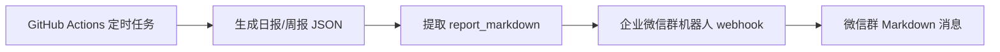
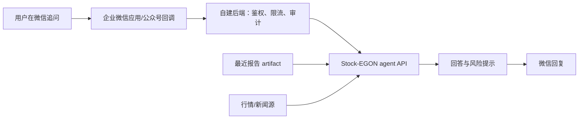

# 微信机器人接入说明

## 当前支持：企业微信群机器人单向推送

当前仓库已经支持企业微信群机器人 webhook。GitHub Actions 生成日报或周报后，会读取报告 JSON 的 `data.report_markdown` 字段，并通过 `WECHAT_WEBHOOK_URL` 推送到企业微信群。

配置步骤如下：在企业微信群中添加群机器人，复制 webhook 地址；在 GitHub 仓库 `Settings` -> `Secrets and variables` -> `Actions` 中新增 `WECHAT_WEBHOOK_URL`；手动运行一次 `US Stock Portfolio Report` workflow，确认日志里的 `send_wechat_report` 返回 `sent=true`。

未配置 `WECHAT_WEBHOOK_URL` 时，发送脚本会返回 `skipped=true`，日报和周报仍然正常生成 artifact。配置了 webhook 但企业微信返回错误时，发送脚本会用非零退出码暴露失败，避免假装已经推送。

## 交互式问答的边界

企业微信群机器人 webhook 不能接收用户消息，因此它不能完成“我在微信里追问，它继续回答”的交互。它适合做定时推送，不适合做对话入口。

交互式问答需要单独增加消息入口和后端服务。推荐方案是企业微信应用或微信公众号接收用户消息，自建后端校验签名和白名单，然后把问题、最近一次报告、持仓配置和可用新闻源一起交给 agent API，最后把回答发回微信。

这个后端需要明确几个安全规则：只允许白名单用户提问；不接入券商交易权限；不自动下单；所有回答保留研究辅助免责声明；真实持仓、OpenAI key、新闻源 key 只存在服务端环境变量或 secret manager 中。

## 后续开发接口

当前通知层在 `us_stock_agent/notifications.py`，CLI 入口是 `scripts/send_wechat_report.py`。后续做交互式问答时，可以复用报告生成、组合风险和动作解释模块，把微信回调服务作为新的入口接入，而不是改动日报和周报的核心流程。
